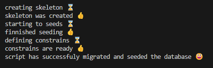
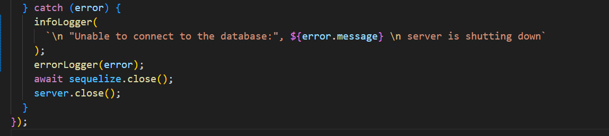

# Germany assist Backend

This is the first commit containing the scaffolding of our project please read the next steps to run the application properly

## Installation

After cloning, use npm install.

```
npm install
```

## Enviroment

Please create a .env file following the sample_env.txt file structure
Also, you need to name the file (dev.env) for the current script to work. A screenshot of the files will be down below

Database should exist with the same name in the env file.

## Scripts

Currently, only the dev script exists, which will run the app with the dev.env file as the environment file, and the app will run in watch mode (meaning the app will restart after each time you edit the code)

```bash
npm run dev
```

# about the code

This version only contains the basic scaffolding of the app, a database model called users was created for testing, only one temp router called users was created, which will lead to two routes:-

1. http://localhost:3000/user -- using the GET method will get all the users in the Users table
2. http://localhost:3000/user -- using the POST method will create a new user firstname "test" in the Users table

## Notice

1.  Sequelize was used; however, currently, the Sequelize CLI will not work properly
2.  The current app does not have any error handling
3.  Cors was added, but needs to be configured
4.  Prettier was used to lint the code using the default configuration

## Folder Structure


## Database

### Models

Following the MVC pattern models were created.

Current models:

- Business Profiles: representing all the business profiles without the ability to list services.
- Providers Profiles: business with listing services.
- User: contains all the user info
- Service: listing all the services.
- UserServices: organizing the services requested by the users.
- Contract: rules and relations between users and service providers should be subjected to.
- Reviews: reviews and ratings on all the services.
- Coupon: coupons to be redeemed.
- Assets: contains all the URLs for the assets that were uploaded.
- Favourite: holds the favorite services of the users

Other models :

- users_business_profiles
- users_providers_profiles

Some of the missing models :

- Transactions
- Posts
- Comments
- Categories
- Badges
- Events
- Locations
- Policies

Please note that the above model name might slightly differ

### Scripts Seeds And Files

Inside the Database Forlder, you will find many files including :

- dbIndex.js
- migrateAndSeed.js

dbIndex creates all the relations constraints inside a function and collects all the models to export the usefully, to use the models just import "db" and it will contain all the models.

```javascript I'm A tab
import db from "../database/dbIndex.js";
db.User.create(user);
```

migrateAndSeed is the script responsible for proper creation and seeding and constraints of the database,
since seeding the database with constraints will create errors.

"Basically you might add an entity of a foreign key that doesn't exist yet"

It works in three stages:

1. Creates the skeleton.
2. Seeds the data.
3. Apply the constraints.

However, this script will delete everything before in the database so it's locked to "test" or "dev" environments.

To run the script:

```
npm run dbInit
```



```javascript
dbInit: "node --env-file=dev.env ./database/migrateAndSeed.js",
```

### Notes :

- the dummy data are not logical nor realistic for example you might find a service with a lot of reviews that don't actually exist or a total rating for a provider that exceeds the actual review count.
- It's only for testing and development you can adjust the enviroment variables to meet toy demands.
- init file will be created in the future to reduce the import statements.

### Adding more models

1. Create the model in models folder
2. Add proper constraints to the dbIndex.js file
3. Add the model the the db object depnding if its needed or not
4. In case of seeds create the seeds file inside the seeds folder
5. register the file in the migrateAndSeed.js
6. make sure of following the pattren in the in migrateAndSeed

## Logging

The app has three loggers using winston logger and morgan, all of which loggers will collect the timestamps and the error stack if needed, the loggers follow the application environment which means their behavior might change depending on the environment further explanation blow.

### 1. Http Logger:

This logger will print on the console the incoming requests the response code and the response time and will save the log file with the same info, the logger is automatically implemented with the Morgon logger

### 2. Error Logger

Error logger is responsible for printing errors to the console and saving them locally, please note that in the `dev` environment the error stack will be printed and saved but in the `production` environment the error stack will not be printed instead it will print error notifications.

### 3. Debug Logger

Use this logger to print any information that you might find helpful during debugging, please note that in `production` the logger will catch nothing also in the debug logger no data will be saved

### 4. Info Logger

Info logger is not an independent logger however it utilizes the debug logger to save and print data, use cases are for informative non-sensitive important info like server start time stamp and server down.

### How To Use

first you can import each logger spreatly:

```js
import infoLogger from "./utils/loggers.js";
import errorLogger from "./utils/loggers.js";
import debugLogger from "./utils/loggers.js";
import httpLogger from "./utils/loggers.js";
```

- http logger will not be used manuly instaed its impeded with morgan package to collect data about requests to check how it works visit the `.\middlewares\morgan.middleware.js` file.

- Error logger: should recive the error only instance the logger will collect the message and the stack.
  ```js
  errorLogger(error);
  ```
- Info Logger:
  ```js
  infoLogger("server is shutting down");
  ```
- debugLogger:
  ```js
  infoLogger("Testing if the function was called correctly");
  ```

### Important to know

- The log file will be created daily and will be deleted after 14 days and cannot exceed 20mb.
- log are saved at `./log` directory, each file name will contain the level and the date: `errors-2025-07-06.log`.
- tThe Loggers will read the env file and set the log level.
- logs are not encrypted since no sensitive info exists in them, not collecting sensitive information is good, it will reduce the load on the server "since we are not encrypting them" also can easily be used in the future for analytics.

### Examples

For this example, i missed the database password in the env file wich will triger the error logger and the info logger
infoLogger.png;

this mistake will print this on the console importnat to notice that two logger where used the error logger and the info logger note that the error stack will be printed if the env was production like the example below

```
2025-07-06 19:26:47:2647 info:
 "Unable to connect to the database:", password authentication failed for user "postgres"
 server is shutting down
2025-07-06 19:26:47:2647 error:  password authentication failed for user "postgres" Error occurred please check the logs
```

however the error stack will be writen to the log file also the info log will be writen.

## JWT AND Cookies

This app will provide access tokens and refresh tokens

1. both their secrets and expiration will be in the `env` file.
2. The routes will utilize the JWT middleware where the token will be automatically verified and decrypted to `req.auth`
