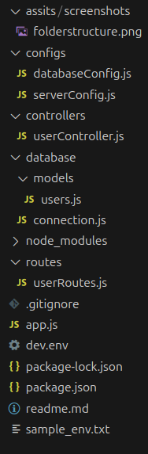

# Germany assist Backend

This is the first commit containing the scaffolding of our project please read the next steps to run the application properly

## Installation

After cloning, use npm install.

```
npm install
```

## Enviroment

Please create a .env file following the sample_env.txt file structure
Also, you need to name the file (dev.env) for the current script to work. A screenshot of the files will be down below

Database should exist with the same name in the env file.

## Scripts

Currently, only the dev script exists, which will run the app with the dev.env file as the environment file, and the app will run in watch mode (meaning the app will restart after each time you edit the code)

```bash
npm run dev
```

# about the code

This version only contains the basic scaffolding of the app, a database model called users was created for testing, only one temp router called users was created, which will lead to two routes:-

1. http://localhost:3000/user -- using the GET method will get all the users in the Users table
2. http://localhost:3000/user -- using the POST method will create a new user firstname "test" in the Users table

## Notice

1.  Sequelize was used; however, currently, the Sequelize CLI will not work properly
2.  The current app does not have any error handling
3.  Cors was added, but needs to be configured
4.  Prettier was used to lint the code using the default configuration

## Folder Structure


