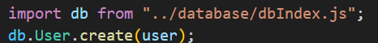

# Germany assist Backend

This is the first commit containing the scaffolding of our project please read the next steps to run the application properly

## Installation

After cloning, use npm install.

```
npm install
```

## Enviroment

Please create a .env file following the sample_env.txt file structure
Also, you need to name the file (dev.env) for the current script to work. A screenshot of the files will be down below

Database should exist with the same name in the env file.

## Scripts

Currently, only the dev script exists, which will run the app with the dev.env file as the environment file, and the app will run in watch mode (meaning the app will restart after each time you edit the code)

```bash
npm run dev
```

# about the code

This version only contains the basic scaffolding of the app, a database model called users was created for testing, only one temp router called users was created, which will lead to two routes:-

1. http://localhost:3000/user -- using the GET method will get all the users in the Users table
2. http://localhost:3000/user -- using the POST method will create a new user firstname "test" in the Users table

## Notice

1.  Sequelize was used; however, currently, the Sequelize CLI will not work properly
2.  The current app does not have any error handling
3.  Cors was added, but needs to be configured
4.  Prettier was used to lint the code using the default configuration

## Folder Structure


## Database

### Models

Following the MVC pattern models were created.

some of the current models:-

- Business Profiles: representing all the business profiles without the ability to list services.
- Providers Profiles: business with listing services.
- User: contains all the user info
- Service: listing all the services.
- UserServices: organizing the services requested by the users.
- Contract: rules and relations between users and service providers should be subjected to.
- Reviews: reviews and ratings on all the services.
- Coupon: coupons to be redeemed.
- Assets: contains all the URLs for the assets that were uploaded.
- Favourite: holds the favorite services of the users

Other models :

- users_business_profiles
- users_providers_profiles

Some of the missing models :

- Transactions
- Posts
- Comments
- Categories
- Badges
- Events
- Locations
- Policies

Please note that the above model name might slightly differ

### Scripts Seeds And Files

Inside the Database Forlder, you will find many files including :

- dbIndex.js
- migrateAndSeed.js

dbIndex creates all the relations constraints inside a function and collects all the models to export the usefully, to use the models just import "db" and it will contain all the models.

<!-- ```javascript I'm A tab
import db from "../database/dbIndex.js";
db.User.create(user)
``` -->



migrateAndSeed is the script responsible for proper creation and seeding and constraints of the database,
since seeding the database with constraints will create errors.

"Basically you might add an entity of a foreign key that doesn't exist yet"

It works in three stages:

1. Creates the skeleton.
2. Seeds the data.
3. Apply the constraints.

However, this script will delete everything before in the database so it's locked to "test" or "dev" environments

To run the script:

```
npm run dbInit
```

Which will run the script with dev.env file
